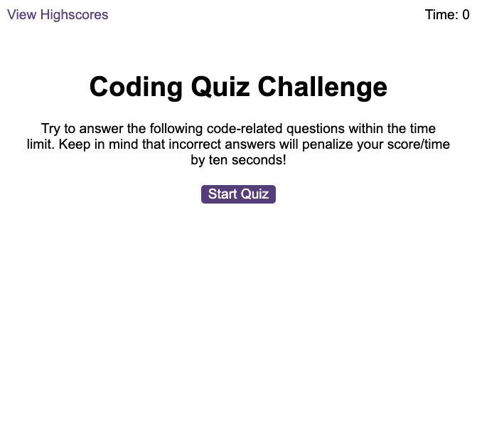

# Code Quiz
A code quiz with multiple-choice questions which is timed. Written in JavaScript.

## Instructions
1. Works in any web browser, just open URL and click "Start Quiz"
2. Timer will begin, read questions and pick the correct answer from choices.
3. Once all questions answered or timer runs out save initials and score.

## Link
https://mam-rahman.github.io/Code-Quiz-JS/

## Screenshot

## License
MIT
